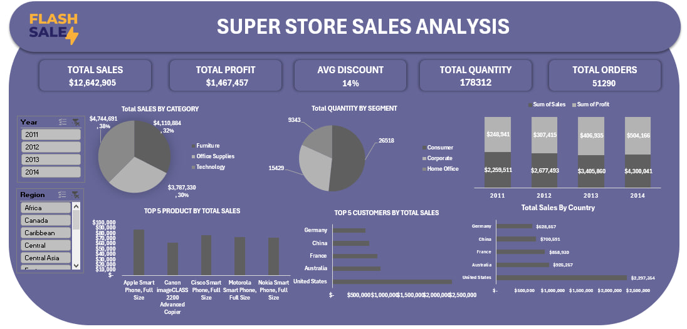

# ⚡ Flash Sale Superstore Sales Dashboard - Excel

## 📌 Project Overview
This dashboard delivers a comprehensive sales performance analysis for a **Flash Sale Superstore**, a multi-category retailer operating across multiple regions and countries. Built entirely in **Microsoft Excel**, the dashboard tracks revenue, profit, discounts, quantity, and order volumes to help stakeholders identify growth opportunities, optimize pricing strategies, and improve operational efficiency.

## 🖥️ Dashboard Preview

## 🎯 Objectives
- Monitor total sales, profit, average discount, quantity, and order count.
- Analyze sales distribution by category and region.
- Track profit trends year-over-year.
- Identify top-performing products and customers.
- Provide actionable insights to optimize product mix, pricing, and customer targeting.

## 🛠️ Tools Used
- **Microsoft Excel** – Full dashboard development (Pivot Tables, Charts, Slicers, Formulas)
- **Power Query** – Data cleaning and transformation
- **Conditional Formatting** – Visual emphasis on KPIs

## 💡 Key Insights
- **Total Sales** reached **$12.6M**, with a total profit of **$1.47M**.
- The average discount across all transactions is **14%**, suggesting room for margin optimization.
- **Office Supplies** is the top-selling category (**38%** of total sales), followed by **Technology** (**32%**) and **Furniture** (**30%**).
- The **Corporate** segment leads in quantity sold, followed by **Home Office** and **Consumer**.
- Sales have grown steadily from **2011** to **2014**, with profits increasing each year.
- The **United States** is the top-performing country with **$2.3M** in sales.
- **Apple Smart Phone (Full)** is the best-selling product, followed by Canon, Cisco, Motorola, and Nokia.

## 📋 Dashboard Features

### Key Performance Indicators (KPIs)
- **Total Sales** – Overall revenue generated
- **Total Profit** – Net earnings
- **Avg Discount** – Average discount percentage applied
- **Total Quantity** – Units sold
- **Total Orders** – Number of transactions

### Filters & Interactivity
- Slicers to filter data by:
  - Year (2011–2014)
  - Region
  - Category
  - Segment

### Visualizations
- **Pie charts** – Sales by category and quantity by segment
- **Bar charts** – Sales and profit trends by year
- **Treemap** – Sales distribution by country
- **Horizontal bar charts** – Top 5 products and top 5 customers
- **Cards** – KPI summaries at the top
